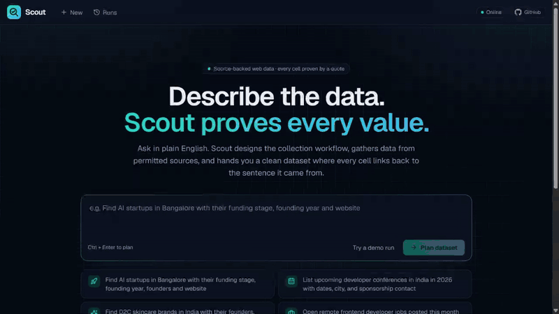
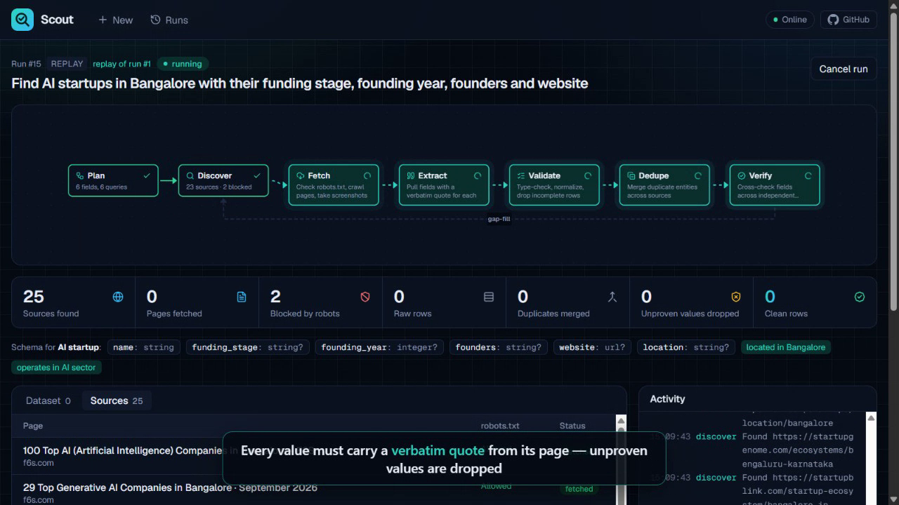
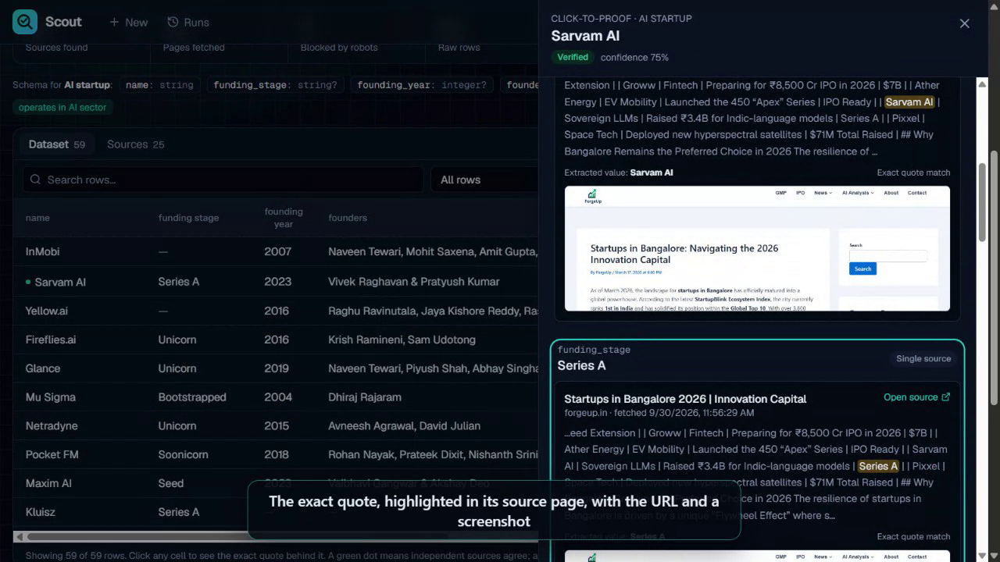
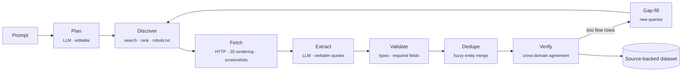

<div align="center">


# Scout

### Describe the data. Scout proves every value.

An AI-powered data intelligence platform that turns a plain-English request into a clean, structured,
**source-backed** dataset — where every single cell links to the exact sentence it came from.

[](https://scout-online.vercel.app)
[](docs/scout-demo.mp4)
[](docs/Scout-Pitch-Deck.pptx)


**Code Cubicle 6.0 · Problem Statement 01 — AI-Powered Data Intelligence Platform**

</div>

---

<div align="center">
  
  <br/>
  <sub>Prompt → editable AI plan → live workflow → Click-to-Proof → filter &amp; export. &nbsp;<a href="docs/scout-demo.mp4">Watch the full-quality MP4</a></sub>
</div>

---

## Table of contents

- [The problem](#the-problem)
- [What Scout does](#what-scout-does)
- [Key features](#key-features)
- [How it works](#how-it-works)
- [Problem-statement coverage](#problem-statement-coverage)
- [Tech stack](#tech-stack)
- [Getting started](#getting-started)
- [Configuration](#configuration)
- [Deployment](#deployment)
- [API reference](#api-reference)
- [Testing](#testing)
- [Project structure](#project-structure)
- [Limitations](#limitations)

## The problem

Businesses constantly need specific data from the web — sales leads, job openings, sponsors, market lists.
Building a scraper for every question is slow and brittle, and **LLM-based scrapers hallucinate**: they
return confident values that no source ever stated. A dataset you cannot verify is a dataset you cannot use.

## What Scout does

You type a request such as:

> *"Find AI startups in Bangalore with their funding stage, founding year, founders and website"*

Scout then:

1. **Plans** — an LLM designs the dataset: what one row is, typed fields, filters, a search region and search queries. You can edit all of it before running.
2. **Collects** — searches the web, checks **robots.txt** for every page, and reads only permitted pages (rendering JavaScript-heavy sites when needed).
3. **Proves** — extraction must return a **verbatim quote** for every field. If the quote is not on the page, or the value is not in the quote, the value is dropped.
4. **Verifies** — merges duplicates across sites and cross-checks each field: *verified* (2+ independent domains agree), *single source*, or *conflict*.
5. **Delivers** — a live, searchable dataset with per-cell evidence, insights, history and CSV / XLSX / JSON export.

In our test run this produced **59 clean rows in about a minute**, with **15 unproven values automatically rejected**.

## Key features

| | Feature | Why it matters |
|---|---|---|
| 🔎 | **Click-to-Proof** | Click any cell to see the exact quote highlighted inside its source page, the URL, fetch time and a screenshot. |
| 🛡️ | **No quote, no value** | Values without a verbatim, on-page quote are rejected — hallucinations are filtered out by design, and counted. |
| ✅ | **Cross-source verification** | Fields are compared across independent domains; disagreements are flagged, and a person resolves them in one click. |
| 🧭 | **Editable AI plan** | Fields, types, required flags, filters, region, queries and blocked domains — reviewed before anything runs. |
| ⚡ | **Live workflow graph** | Every step streams over Server-Sent Events; rows appear while the run is still going. A *gap-fill* loop searches again when too few rows are found. |
| 🤝 | **Permitted sources only** | robots.txt checked per page (RFC 9309); social networks, login-only sites and ad links are always blocked. |
| 📊 | **Dataset tools** | Full-text search, trust filters, sortable columns, insights (trust, completeness, source health), CSV / XLSX / JSON export. |
| 🕘 | **History, diff & replay** | Every run is stored. Re-run a workflow and see *+new / ~changed / −removed*; replay any run offline for demos. |
| 💸 | **Runs on free tiers** | Groq free-tier LLMs with automatic model fallback on rate limits, free search, disk caching of pages, searches and LLM answers. |

<table>
  <tr>
    <td width="50%"></td>
    <td width="50%"></td>
  </tr>
  <tr>
    <td align="center"><sub>Live workflow: every step and counter updates in real time</sub></td>
    <td align="center"><sub>Click-to-Proof: the quote, its source page and a screenshot</sub></td>
  </tr>
</table>

## How it works



**The trust layer**

- **Quote check:** a quote must appear on the fetched page. Formatting differences (markdown, punctuation, spacing) are forgiven; changed words are not — "Series C" is rejected when the page says "Series A". The value must also appear in its quote.
- **Merging:** entities are matched by a normalised key ("Nimbus Labs Pvt Ltd" = "Nimbus Labs") with fuzzy matching; aliases such as *Bengaluru = Bangalore* are understood.
- **Verification:** per field, the value backed by the most independent domains wins; confidence rises with agreement, and genuine disagreements become conflicts for a person to resolve.

**Architecture**

```
Next.js 15 (web) ──REST + SSE──► FastAPI (api)
  prompt & plan editor             orchestrator: asyncio tasks, cancel, event bus (persisted, replayable)
  live React Flow graph            pipeline: plan · discover · fetch · extract · validate · dedupe · verify
  dataset, Click-to-Proof          LLM: Groq (JSON mode, disk cache, model fallback on 429)
  insights, export, history        storage: SQLite locally / Postgres when hosted
```

## Problem-statement coverage

| PS 01 requirement | Scout |
|---|---|
| Understand data requirements from natural-language prompts | LLM planner → entity, typed fields, filters, region, queries; editable plan screen |
| Dynamically design and execute data-collection workflows | Per-request pipeline shown as a live graph, with a gap-fill loop back to discovery |
| Collect and process information from multiple permitted sources | Web search + robots.txt per page + always-on blocklist + user blocklist |
| Clean, structure, validate and deduplicate results | Type coercion (numbers, money, URLs, emails, dates), required fields, fuzzy entity merging |
| Provide source-backed, traceable data | Per-cell provenance with verbatim quotes, URLs, fetch times and screenshots (Click-to-Proof) |
| Allow users to monitor and manage collection tasks | Live progress over SSE, activity log, counters, cancel, runs list |
| Present results through an interactive dashboard | Dataset grid with per-cell trust markers, sources tab, insights |
| Maintain workflow and dataset history | Stored runs and events, re-run with diff, edit plan and run again, offline replay |
| Allow users to search, filter and export collected data | Search, trust filter, sorting, CSV / XLSX / JSON (JSON includes the evidence) |

## Tech stack

| Layer | Technology |
|---|---|
| Frontend | Next.js 15 (App Router), React 19, TypeScript, Tailwind CSS v4, React Flow, lucide-react |
| Backend | Python 3.12, FastAPI, SQLModel / SQLAlchemy, sse-starlette |
| AI | Groq — `openai/gpt-oss-120b` for planning, `qwen/qwen3.8-27b` for bulk extraction, automatic fallback between models |
| Search | Tavily (when a key is set) or the keyless `ddgs` metasearch library, region-aware |
| Fetching | httpx + trafilatura; Playwright with local Chrome, or Jina Reader when no browser is available |
| Matching | RapidFuzz |
| Storage | SQLite (local) · Postgres (hosted) — runs, events, provenance, page text and screenshots |
| Export | CSV, XLSX (openpyxl), JSON |

## Getting started

**Requirements:** Python 3.12, Node.js 20+, Google Chrome (or Edge) for JavaScript pages and screenshots, and a free [Groq API key](https://console.groq.com/keys).

**1. Backend**

```bash
cd api
python -m venv .venv                      # Windows: py -3.12 -m venv .venv
.venv/Scripts/pip install -r requirements.txt   # macOS/Linux: .venv/bin/pip
cp .env.example .env                      # add GROQ_API_KEY
.venv/Scripts/python -m uvicorn app.main:app --port 8000
```

**2. Frontend**

```bash
cd web
npm install
npm run dev                               # http://localhost:3100
```

Open **http://localhost:3100**, pick an example request and click **Plan dataset**. The **Try a demo run** button plays a scripted run with fictional data and needs no API key.

> On Windows, avoid `uvicorn --reload`: it can leave an orphaned worker on port 8000 serving old code.

## Configuration

All settings are environment variables (see [`api/.env.example`](api/.env.example)).

| Variable | Default | Purpose |
|---|---|---|
| `GROQ_API_KEY` | — | **Required.** Free key from console.groq.com |
| `GROQ_MODEL` / `GROQ_FAST_MODEL` | `openai/gpt-oss-120b` / `qwen/qwen3.8-27b` | Planning / extraction models |
| `TAVILY_API_KEY` | — | Search API; recommended when hosted (search engines often give cloud servers generic results) |
| `DATABASE_URL` | local SQLite | Postgres connection string for hosted deployments |
| `SCOUT_BROWSER` | `on` | Local headless browser for JS pages and screenshots; set `off` on small hosts |
| `SCOUT_REMOTE_RENDER` | `on` | Use Jina Reader for JS pages and screenshots when no local browser is available |
| `JINA_API_KEY` | — | Optional, raises Jina Reader's free rate limit |
| `SEARCH_ENGINES` | `duckduckgo,yahoo,brave,bing` | Engines used by `ddgs` |
| `CORS_ORIGINS` / `CORS_ORIGIN_REGEX` | `http://localhost:3100` / — | Allowed frontend origins (e.g. `https://.*\.vercel\.app`) |
| `SCOUT_REPLAY_SECONDS` | `40` | Duration of a replayed run |
| `NEXT_PUBLIC_API_URL` (web) | `http://localhost:8000` | Where the frontend finds the API |

## Deployment

The live version runs entirely on free tiers: **Vercel** (frontend) and **Render** (API + Postgres).

**Backend — Render.** [`render.yaml`](render.yaml) defines the web service and a free Postgres database.
1. render.com → **New → Blueprint** → select this repository → Apply.
2. Set `GROQ_API_KEY` and `TAVILY_API_KEY` when prompted. The blueprint wires `DATABASE_URL` and sets `SCOUT_BROWSER=off` (the free instance has 512 MB) with remote rendering on.
3. Check `https://<service>.onrender.com/api/health` → `"database":"postgres"`, `"search":"tavily"`.

**Frontend — Vercel.** Import the repository → Root Directory **`web`** → set `NEXT_PUBLIC_API_URL` to the Render URL → Deploy.

Free Render instances sleep after ~15 idle minutes. The frontend detects this, shows a *waking up* banner, and holds requests until the API answers; a keep-alive ping runs while the page is open. An uptime monitor on `/api/health` keeps it awake permanently.

[`api/Dockerfile`](api/Dockerfile) runs the full version (with a local browser) on any container host with ~2 GB of RAM.

## API reference

| Method | Endpoint | Description |
|---|---|---|
| `GET` | `/api/health` | Status, models, database, renderer and search provider |
| `POST` | `/api/workflows` | Plan a workflow from `{ "prompt": "..." }` |
| `GET` / `PUT` | `/api/workflows/{id}` | Read / update the plan |
| `POST` | `/api/workflows/{id}/runs` | Start a run (`{ "mode": "live" }`) |
| `GET` | `/api/runs` · `/api/runs/{id}` | List runs · run details |
| `GET` | `/api/runs/{id}/events` | Live event stream (Server-Sent Events) |
| `GET` | `/api/runs/{id}/records` · `/sources` | Dataset rows · sources with robots.txt status |
| `GET` | `/api/records/{id}/provenance` | Click-to-Proof evidence for a row |
| `POST` | `/api/records/{id}/resolve` | Resolve a conflicting field |
| `GET` | `/api/runs/{id}/export?format=csv\|xlsx\|json` | Export the dataset |
| `GET` | `/api/runs/{id}/diff` | Compare with the previous run of the same workflow |
| `POST` | `/api/runs/{id}/replay` · `/cancel` | Replay a finished run · cancel a running one |

## Testing

```bash
cd api && .venv/Scripts/python -m pytest -q        # 46 tests, fully offline
cd web && npx tsc --noEmit && npm run lint && npx next build
```

The suite covers planning and validation, URL normalisation, blocklists, robots.txt rules, the verbatim-quote and value checks (including hallucinated values), type coercion, entity merging and aliases, conflict detection, evidence location, remote rendering and bot-wall detection, search providers, exports, diffs, schema migration, SSE streaming and replay.

## Project structure

```
api/
  app/main.py              REST + SSE endpoints
  app/llm.py               Groq client: JSON mode, cache, model fallback
  app/events.py            per-run event bus (persisted, replayable)
  app/pipeline/            plan · discover · live (orchestration) · extract · validate · merge · replay · demo
  app/services/            search · robots · crawler · evidence · export
  tests/                   offline test suite
web/
  app/                     pages: home, plan/[id], runs, runs/[id]
  components/              RunGraph, DatasetView, ProofPanel, Insights, BackendStatus
  lib/                     API client, run stream, backend wake-up
docs/                      demo video, GIF and screenshots
render.yaml                Render blueprint (API + Postgres)
```

## Limitations

- Results reflect what public pages actually state; many rows are single-source, and Scout shows that instead of hiding it.
- Some directories behind bot protection (e.g. Cloudflare checks) refuse automated access; they are skipped and reported in the activity log.
- Free-tier limits (Groq tokens, Tavily searches, Jina requests) cap how many large runs can be made per day; caching makes repeat runs nearly free.

---

<div align="center">
<sub>Built by <a href="https://github.com/geekksv">geekksv</a> for Code Cubicle 6.0 · <a href="https://scout-online.vercel.app">scout-online.vercel.app</a></sub>
</div>
